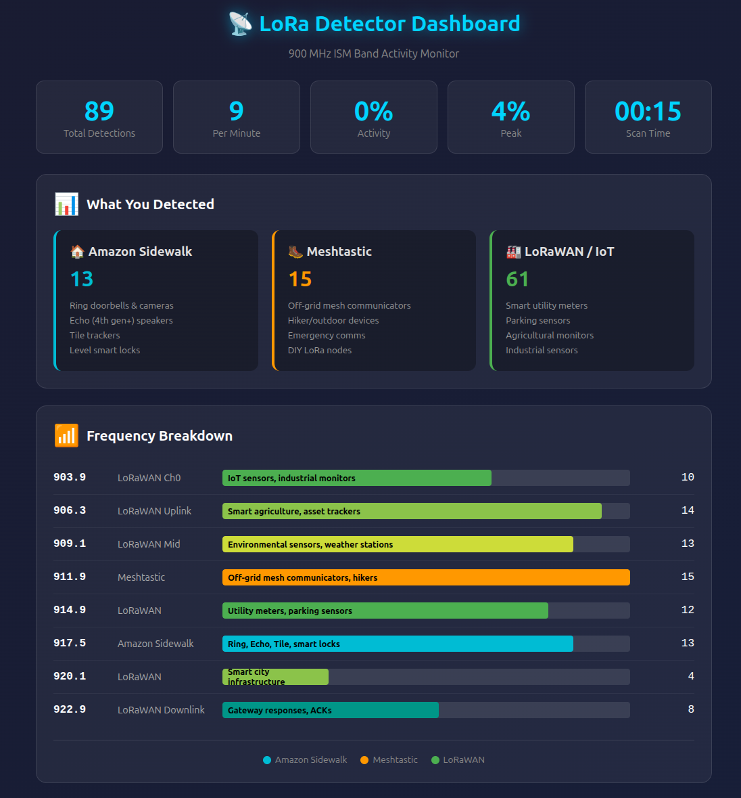

# LoRa Activity Detector

A portable LoRa signal detector built on the Heltec WiFi LoRa 32 V3. Scans the 900 MHz ISM band for LoRa transmissions and displays real-time activity with multiple visualization modes.

## Hardware

| Component | Details |
|-----------|---------|
| **Board** | Heltec WiFi LoRa 32 V3 |
| **MCU** | ESP32-S3 (dual-core, 240MHz) |
| **LoRa Radio** | Semtech SX1262 |
| **Display** | 0.96" OLED 128x64 (SSD1306) |
| **Connectivity** | WiFi, Bluetooth LE, LoRa |

## Features

- **16 Display Modes** - Cycle with PRG button (8 general + 8 frequency-specific)
- **Frequency Hopping** - Scans 8 frequencies across 903-923 MHz
- **Channel Activity Detection (CAD)** - Hardware-based LoRa preamble detection
- **Per-Frequency Monitoring** - Dedicated heartbeat display for each frequency
- **Stats Tracking** - Uptime, detections, activity %, peak activity
- **WiFi Upload** - Double-click to upload stats to cloud dashboard
- **Cloud Dashboard** - View real-time and historical data at https://lora-detector.fly.dev/
- **SQLite Persistence** - All uploads stored for 1 year with historical summaries
- **Historical Analysis** - View aggregated stats for 7 days, 30 days, 90 days, 1 year
- **Portable** - Runs on USB power, great for drive-around scanning

---

## Frequency Chart: What You're Detecting

### US 900 MHz ISM Band (902-928 MHz)

| Frequency | Primary Use | Common Devices |
|-----------|-------------|----------------|
| **903.9 MHz** | LoRaWAN US915 Ch0 | IoT sensors, industrial monitors |
| **906.3 MHz** | LoRaWAN US915 uplink | Smart agriculture, asset trackers |
| **909.1 MHz** | LoRaWAN US915 | Environmental sensors |
| **911.9 MHz** | Meshtastic default | Off-grid mesh communicators |
| **914.9 MHz** | LoRaWAN US915 | Utility sensors |
| **917.5 MHz** | Amazon Sidewalk | Ring, Echo devices |
| **920.1 MHz** | LoRaWAN US915 | Smart city infrastructure |
| **922.9 MHz** | LoRaWAN US915 downlink | Gateway responses |

### Amazon Sidewalk (900 MHz LoRa)

Amazon Sidewalk is a neighborhood mesh network using LoRa at 900 MHz. If you're detecting signals, they're likely from:

| Device | Function |
|--------|----------|
| **Ring Doorbell/Cameras** | Act as Sidewalk bridges, relay data |
| **Ring Floodlight Cam** | Built-in sub-GHz LoRa radio |
| **Echo (4th gen+)** | Sidewalk bridge with LoRa |
| **Echo Show 10** | Built-in LoRa transceiver |
| **Tile Trackers** | Use Sidewalk for location updates |
| **Level Smart Lock** | Sidewalk-enabled |
| **CareBand** | Senior tracking wearables |

**Sidewalk Frequencies:**
- Primary: 915-917 MHz (LoRa)
- Also uses: 900 MHz FSK, 2.4 GHz BLE

### LoRaWAN US915 Band Plan

LoRaWAN in the US uses 64 uplink + 8 downlink channels:

```
Uplink (125 kHz):   902.3 - 914.9 MHz (64 channels, 200 kHz spacing)
Uplink (500 kHz):   903.0 - 914.2 MHz (8 channels)
Downlink (500 kHz): 923.3 - 927.5 MHz (8 channels)
```

**Common LoRaWAN Devices:**
- Smart utility meters (water, gas, electric)
- Parking sensors
- Agricultural sensors (soil, weather)
- Industrial monitoring
- Asset trackers
- Smart city infrastructure

### Meshtastic

Open-source LoRa mesh networking for off-grid communication:

| Region | Frequency |
|--------|-----------|
| US/Canada | 906.875 - 924.875 MHz |
| Default | 911.9 MHz |

### Smart Meters & Utilities

Many utilities use 900 MHz for meter reading:

| Technology | Frequency Range | Use |
|------------|-----------------|-----|
| **Itron/OpenWay** | 902-928 MHz | Electric meters |
| **Landis+Gyr** | 902-928 MHz | Electric/gas meters |
| **Neptune** | 902-928 MHz | Water meters |
| **Sensus FlexNet** | 902-928 MHz | Multi-utility |

---

## Display Modes

Press **PRG button** (single click) to cycle through modes:

### 1. SPECTRUM
```
┌─────────────────────────────────┐
│ SPECTRUM           Det:1337    │
│─────────────────────────────────│
│    ▼                           │
│  ██ ▄▄ ▄▄ ██ ▄▄ ▄▄ ▄▄ ██      │
│  03 06 09 11 14 17 20 22       │
└─────────────────────────────────┘
```
8 frequency bars showing activity per channel. Triangle marks current scanning frequency.

### 2. RADAR
```
┌─────────────────────────────────┐
│   ╭───╮    │ RADAR             │
│   │ / │    │ 912MHz            │
│   │●  │    │ Activity: ████ 45%│
│   ╰───╯    │ Det: 127          │
└─────────────────────────────────┘
```
Classic radar sweep with blips for detections.

### 3. BIG %
```
┌─────────────────────────────────┐
│ ACTIVITY LEVEL                  │
│                                 │
│          45%                    │
│    [████████████░░░░]           │
│ Det:127              912MHz     │
└─────────────────────────────────┘
```
Giant percentage display - easy to read at a glance.

### 4. METER
```
┌─────────────────────────────────┐
│      SIGNAL METER               │
│      ╭─────────╮                │
│     0    50   100               │
│         ⟋                       │
│        45%           >>>        │
└─────────────────────────────────┘
```
Analog VU meter style with smooth needle animation.

### 5. HEARTBEAT
```
┌─────────────────────────────────┐
│ HEARTBEAT           Det:127     │
│─────────────────────────────────│
│ ____╱╲____╱╲_______╱╲____      │
│                                 │
│ Act:5%    912MHz     >>>        │
└─────────────────────────────────┘
```
EKG-style scrolling waveform. Each spike = LoRa detection!

### 6. TERMINAL
```
┌─────────────────────────────────┐
│ LORA TERMINAL                   │
│─────────────────────────────────│
│ > 125 DET 918MHz                │
│ > 126 DET 912MHz                │
│ > 127 DET 923MHz                │
│ UP:1234s DET:127 5%  _          │
└─────────────────────────────────┘
```
Retro hacker terminal with scrolling detection log.

### 7. TOWER
```
┌─────────────────────────────────┐
│      SIGNAL TOWER               │
│─────────────────────────────────│
│           ▄▄  ██                │
│      ▄▄   ██  ██                │
│  ▄▄  ██   ██  ██  ██            │
│  45%           Det:127          │
└─────────────────────────────────┘
```
Cell signal tower style bars.

### 8. STATS
```
┌─────────────────────────────────┐
│ SESSION STATS                   │
│─────────────────────────────────│
│ Uptime: 01:23:45                │
│ Total Detections: 1337          │
│ Det/min: 15                     │
│ Current Activity: 5%            │
│ Peak Activity: 23%              │
└─────────────────────────────────┘
```
Detailed text statistics. Shows "** HOT **" when activity exceeds 10%.

### 9-16. FREQUENCY-SPECIFIC MONITORS

Each frequency has its own dedicated heartbeat display:

```
┌─────────────────────────────────┐
│        917.5 MHz                │
│      Amazon Sidewalk            │
│─────────────────────────────────│
│ ____╱╲____╱╲_______╱╲____      │
│                                 │
│ Det:45   Act:12%    >>>         │
└─────────────────────────────────┘
```

| Mode | Frequency | Primary Use |
|------|-----------|-------------|
| 9 | 903.9 MHz | LoRaWAN Ch0 |
| 10 | 906.3 MHz | LoRaWAN Uplink |
| 11 | 909.1 MHz | LoRaWAN Mid |
| 12 | 911.9 MHz | Meshtastic |
| 13 | 914.9 MHz | LoRaWAN |
| 14 | 917.5 MHz | Amazon Sidewalk |
| 15 | 920.1 MHz | LoRaWAN |
| 16 | 922.9 MHz | LoRaWAN Downlink |

Each frequency-specific screen shows:
- **Title** - Frequency value (e.g., "917.5 MHz")
- **Subtitle** - What the frequency is used for (e.g., "Amazon Sidewalk")
- **Heartbeat** - EKG-style waveform showing detections on that frequency only
- **Stats** - Detection count and activity % for that specific frequency
- **Indicator** - Shows ">>>" when detecting on that frequency, "***" when scanning it

---

## Controls

| Action | Function |
|--------|----------|
| **Single click** PRG | Cycle to next display mode |
| **Double click** PRG | Connect WiFi and upload stats to server (must be fast - within 250ms) |

---

## WiFi Upload Feature

Double-click PRG quickly (within 250ms) to upload stats to the cloud dashboard.

### What Gets Uploaded
```json
{
  "device_id": "lora-detector-1",
  "uptime_seconds": 1847,
  "total_detections": 386,
  "detections_per_min": 15,
  "current_activity_pct": 5,
  "peak_activity_pct": 23,
  "freq_detections": [45, 52, 38, 67, 41, 55, 48, 40]
}
```

### Dashboard
**URL:** https://lora-detector.fly.dev/



**Features:**
- **Category Breakdown** - See detections grouped by Amazon Sidewalk, Meshtastic, and LoRaWAN/IoT
- **Frequency Analysis** - Visual bars showing activity per frequency with device context
- **Real-time Stats** - Total detections, per-minute rate, activity percentage
- **SQLite Persistence** - All uploads stored for 1 year
- **Historical Summaries** - View aggregated stats for 7 days, 30 days, 90 days, and 1 year
- Auto-refreshes every 30 seconds
- Highlights "HOT" activity when above 10%

### Historical Summary

The dashboard tracks your detection history over time:

| Period | Stats Available |
|--------|-----------------|
| **7 Days** | Uploads, detections, scan time, avg det/min, peak activity |
| **30 Days** | Same + per-frequency breakdown visualization |
| **90 Days** | Same |
| **1 Year** | Same |

Each summary includes:
- Total uploads in the period
- Cumulative detections across all sessions
- Total scan time
- Average detections per minute
- Peak activity percentage
- Mini frequency bar chart showing distribution

### API Endpoints

| Endpoint | Description |
|----------|-------------|
| `GET /` | Dashboard web interface |
| `POST /upload` | Upload stats from detector |
| `GET /stats` | Plain text stats summary |
| `GET /api/stats` | JSON current stats |
| `GET /api/history` | JSON historical summaries |

### Configuration
Edit `secrets.h` with your WiFi credentials:
```cpp
#define WIFI_SSID "YourWiFiName"
#define WIFI_PASSWORD "YourPassword"
#define SERVER_URL "https://lora-detector.fly.dev/upload"
#define DEVICE_ID "lora-detector-1"
```

---

## How CAD (Channel Activity Detection) Works

The SX1262 radio has hardware-based Channel Activity Detection:

1. **Listens** for LoRa preamble symbols
2. **Detects** spread-spectrum modulation pattern
3. **Reports** if LoRa signal is present
4. **Cannot decode** packet contents (just presence detection)

This is faster and more power-efficient than full packet reception.

**What CAD Detects:**
- Any LoRa transmission using compatible spreading factor
- Preamble symbols (start of packet)
- Works below noise floor (LoRa's advantage)

**What CAD Cannot Do:**
- Decode packet contents (encrypted anyway for Sidewalk)
- Identify specific devices
- Determine packet destination

---

## Project Structure

```
lora-detector/
├── lora-detector.ino    # Main firmware (8 display modes, WiFi upload)
├── secrets.h            # WiFi credentials (gitignored)
├── deploy.sh            # Build and upload script
├── CLAUDE.md            # Development notes
├── README.md            # This file
├── SCREEN_LAYOUTS.md    # Display mode designs
├── fly.io-LoRa-Detector-Dashboard.png  # Dashboard screenshot
├── .gitignore
├── build/               # Compiled binaries
└── server/              # Cloud backend (Go + SQLite)
    ├── main.go          # Go server with SQLite persistence
    ├── fly.toml         # Fly.io config (includes volume mount)
    ├── Dockerfile       # Go 1.24 Alpine build
    ├── go.mod           # Dependencies (modernc.org/sqlite)
    └── go.sum           # Dependency checksums
```

---

## Build & Deploy

### Prerequisites
- Arduino CLI with ESP32 support
- RadioLib library
- U8g2 library

### Commands
```bash
./deploy.sh          # Compile and upload
./deploy.sh compile  # Compile only
./deploy.sh upload   # Upload only
./deploy.sh monitor  # Serial monitor
```

### Server Deployment

The server uses SQLite for persistence, requiring a Fly.io volume:

```bash
cd server

# First time setup - create volume for database
fly volumes create lora_data --region dfw --size 1

# Scale to 1 machine (required for single volume)
fly scale count 1

# Deploy
fly deploy
```

**Server Stack:**
- Go 1.24 with pure-Go SQLite (modernc.org/sqlite)
- 1GB persistent volume at `/data`
- Auto-cleanup of data older than 1 year
- Single machine deployment (volume limitation)

---

## Technical Specs

| Parameter | Value |
|-----------|-------|
| Scan Frequencies | 903.9, 906.3, 909.1, 911.9, 914.9, 917.5, 920.1, 922.9 MHz |
| Bandwidth | 125 kHz |
| Spreading Factor | SF7 |
| CAD Interval | 50 ms |
| Scans per Frequency | 3 (then hop) |
| Activity Window | 100 samples (~5 seconds) |
| Display Refresh | 100 ms |

---

## Detection Examples

### Driving Around Neighborhood
```
30 minutes driving
386 total detections
15 detections/minute
Peak activity: 23%
```

Primary sources: Ring doorbells, Echo devices acting as Sidewalk bridges, smart meters.

### Near Amazon Warehouse/Facility
Expect high activity from logistics tracking devices.

### Rural Areas
Lower activity, mostly agricultural sensors and utility meters.

### Industrial Areas
LoRaWAN sensors for equipment monitoring.

---

## Troubleshooting

| Issue | Solution |
|-------|----------|
| No detections | Check antenna connection, try different location |
| WiFi fails | Verify credentials in secrets.h, check signal strength |
| Display cut off | Adjust `DISPLAY_Y_OFFSET` in code (default: 6) |
| Upload fails | Check server URL, verify internet connectivity |

---

## Legal Note

This device only **detects** the presence of LoRa signals using Channel Activity Detection. It does **not** decode, decrypt, or intercept any communications. All detected transmissions (Amazon Sidewalk, LoRaWAN, etc.) use encryption that this device cannot break.

This is equivalent to a radio scanner detecting that a transmission exists, not reading its contents.

---

## Credits

- **Hardware:** Heltec WiFi LoRa 32 V3
- **Libraries:** RadioLib, U8g2
- **Hosting:** Fly.io
- **Built with:** Claude Code
